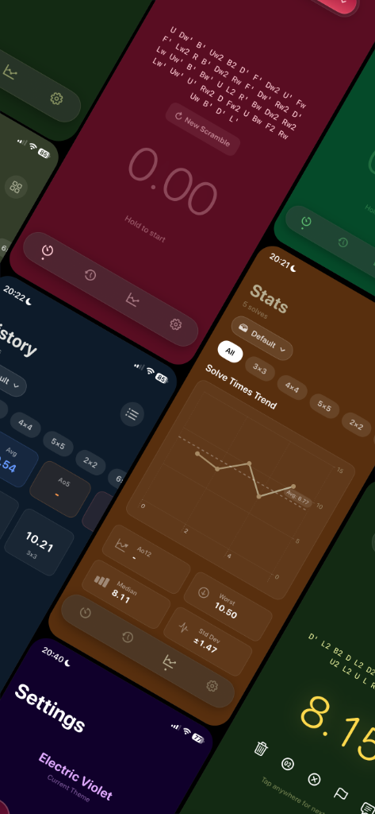
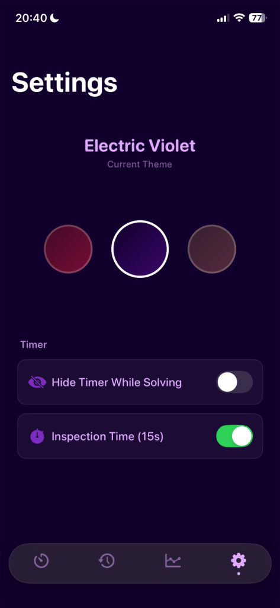
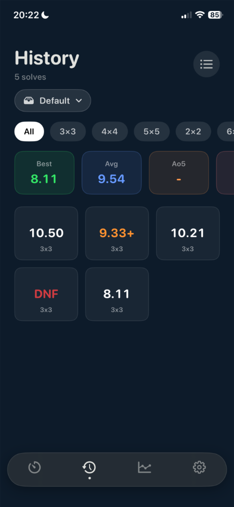
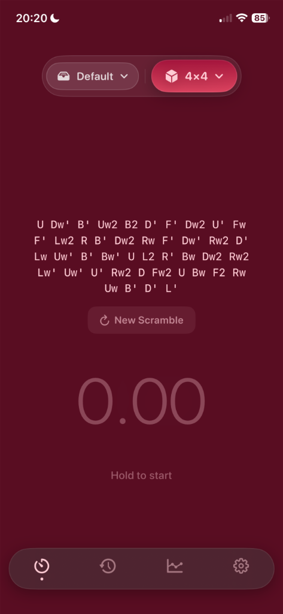
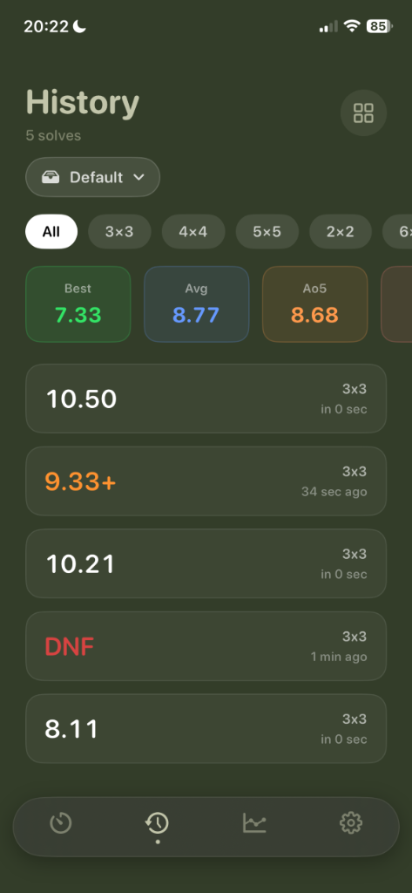
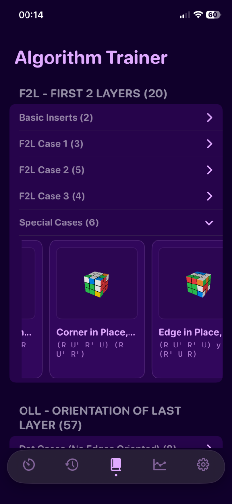
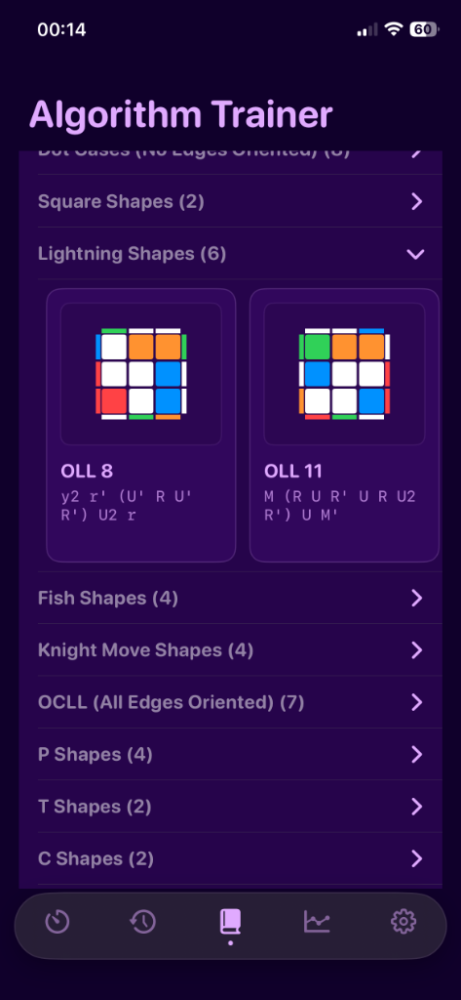
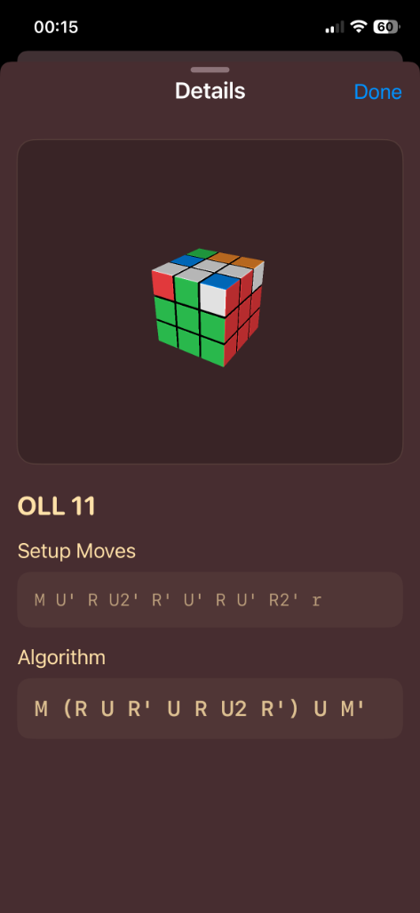

  
  <h1>Lookahead</h1>
  

    <strong>Elevate Your Solving.</strong> 
    The most refined Rubik's Cube timer on iOS.
  

  
  

    <a href="#overview">Overview</a> •
    <a href="#features">Features</a> •
    <a href="#visuals">Visuals</a> •
    <a href="privacy_policy.md">Privacy Policy</a>
  

   

  

 

## Overview
**Lookahead** is built for speedcubers who value aesthetics as much as performance. With a stunning, customizable interface that adapts to your style, it offers precision timing, detailed statistics, and a silky-smooth user experience. Whether you're a speedcuber or a casual solver, enjoy a distraction-free environment designed to help you focus on your next personal best.

---

## Features

### 🎨 Premium Aesthetics
Your timer, your style. Lookahead features an **Infinite Theme Carousel** with 9 curated palettes like *Midnight Onyx* and *Electric Violet*. Every element—from charts to the tab bar—adapts to your chosen theme.

  
  

### 📈 Powerful Statistics
Track your progress with professional-grade analytics.
- **WCA Scrambles**: Supports all puzzle types (2x2 - 7x7, Pyraminx, etc).
- **Interactive Charts**: Visualize your Ao5, Ao12, averages, and trend lines.
- **Detailed History**: Review every solve with context-aware sorting.

### ⚡️ Designed for Speed
- **Inspection Timer**: WCA-style hold-to-start mechanism.
- **Hide Timer**: Option to hide digits while solving to help you look ahead.
- **Haptic Feedback**: Custom haptic patterns for start, stop, and UI interactions.
- **Gesture Control**: Swipe to delete, tap to inspect, hold to start.

  
  
  

### 📚 Algorithm Trainer
Master the cube with a comprehensive library of algorithms.
- **Complete Database**: Includes all OLL, PLL, and F2L cases.
- **Smart Grouping**: Learn efficiently with categorized subsets (e.g., "Dot Cases", "Basic Inserts").
- **Interactive References**: View cases in 3D to understand the logic behind the moves.

  
  
  

---

## Privacy
**Your data belongs to you.**
Lookahead operates completely offline. We do not track your usage, store your data on external servers, or require an account.

[Read our Privacy Policy](privacy_policy.md)

 

  © 2026 Lookahead. Built with ❤️ for the community.

